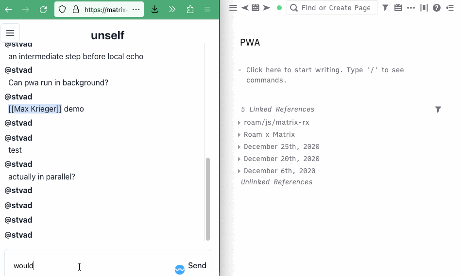

# roam-matrix
        
A [Matrix](https://matrix.org) client for RoamResearch. Built to explore ideas in https://vlad.roam.garden/Bringing-knowledge-and-conversation-closer-together

## Features

- Send autocomplete configuration (only can be interpreted by a [custom matrix client](https://matrix-rx.netlify.app/) atm)
- Monitor a room for new messages and save them to Roam

---

Built on https://github.com/Stvad/matrix-rx
